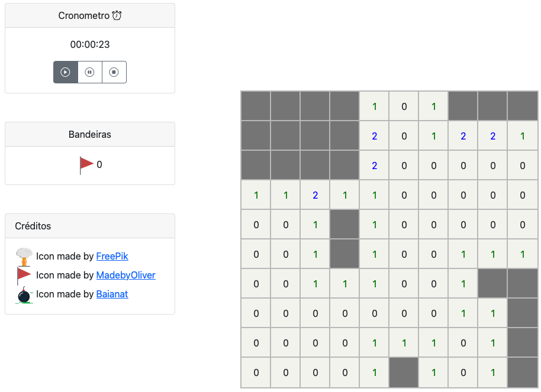
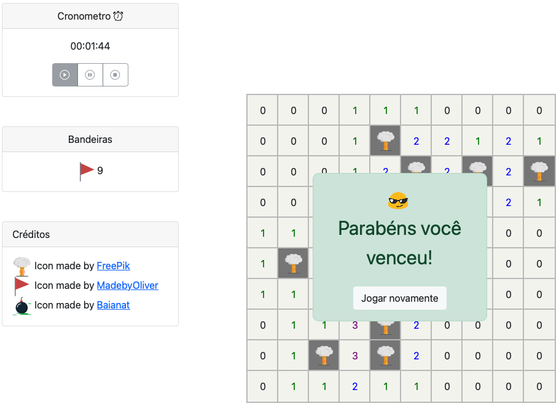
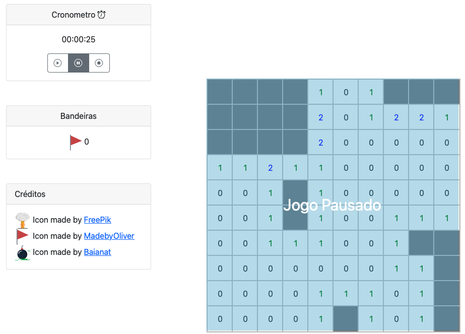

# Campo Minado

**Demo do jogo:** https://gustavodamasceno.github.io/Campo-minado/ 

Nessa questão você vai trabalhar no código do jogo Campo Minando totalmente escrito em HTML, CSS e JS.
O seu objetivo é implementar duas funcionalidades.


### Funcionalidade 01 - Bandeirinhas

- Uma bandeira só pode ser colaocada em quadrados não revelados.
- Para colocar uma bandeira o usuário deve clicar no quadrado e ao mesmo tempo  que mantém a tecla **alt/option** pressionada.
- Para remover uma bandeira o usuário deve clicar na bandeira pressionando a tecla **alt/option**.
- O número de bandeiras que o usuário pode colocar é ilimitado
- Contabilize o número de bandeirinhas de forma que o jogador consiga saber quantas bandeiras ele colocou.

**Dicas:**
- A função `revelarZona` da class `CampoMinado` recebe um booleano como argumento que informa se o usuário tentou colocar uma bandeira.
- A classe `CampoMinado` controla o jogo, porém é necessário atualizar a UI, classe `UI` com as informações da classe `CampoMinado`.

Exemplo de uma partida onde o usuário usou as bandeiras





### Funcionalidade 02 - Cronômetro

- O cronômetro deve iniciar a contagem no momento que o usuário clicar para revelar o primeiro quadrado ou quando o usuário clicar no botão play.
- O cronômetro deve encerrar a contagem e manter o último valor quando umas da duas condições a seguir acontecerem: o usuário perder o jogo ao clicar em uma bomba ou o usuário vencer o jogo.
  - Caso o jogador decidar jogar novamente, o cronômetro deve ser zerado
- O cronômetro deve ser pausado quando o usuário clicar no botão de pause. 
  - Enquanto o jogo estiver pausado, não deve ser possível relevar quadrados. Para isso, uma mensagem de pause deve ser mostrada. **Dica:** Utilize a div *campo_pausado* para isso.
  - O jogo deve despausar quando o usuário clicar no botão play ou stop. Nesse caso, a mensagem de pause deve sumir.
- O cronômetro deve possuir o formato HH:MM:SS.
  - Dica: Utilize 1 segundo como tempo de atualização. O código abaixo realiza o cálculo de horas, minutos e segundos.
  
```javascript
const hora = Math.floor(tempo_em_segundos / (3600));
const minutos = Math.floor((tempo_em_segundos % (3600))/ 60);
const segundos = Math.floor((tempo_em_segundos % (3600)) % 60);
```

- Os botões do cronômetro deve ser desabilitados quando o jogo acaba e re-habilitados em caso do usuário decidir jogar novamente. **Dica:** Utilize o atributo *disabled*.

Exemplo de uma partida onde o usuário pausou o jogo


Exemplo de uma partida com os botões desabilitados no fim da partida

